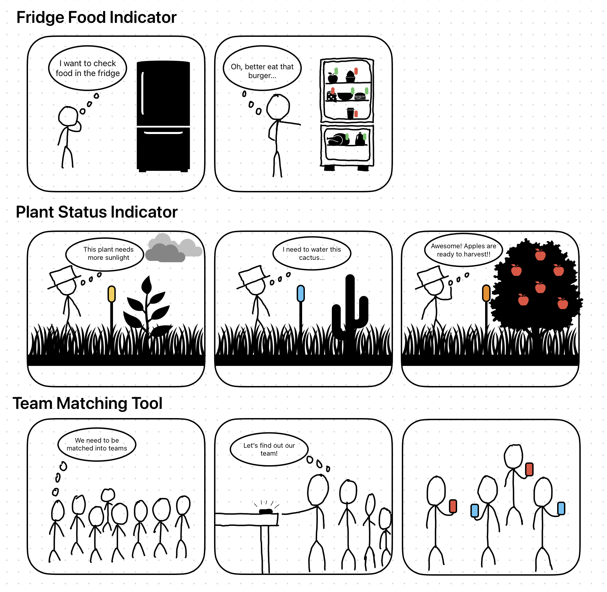
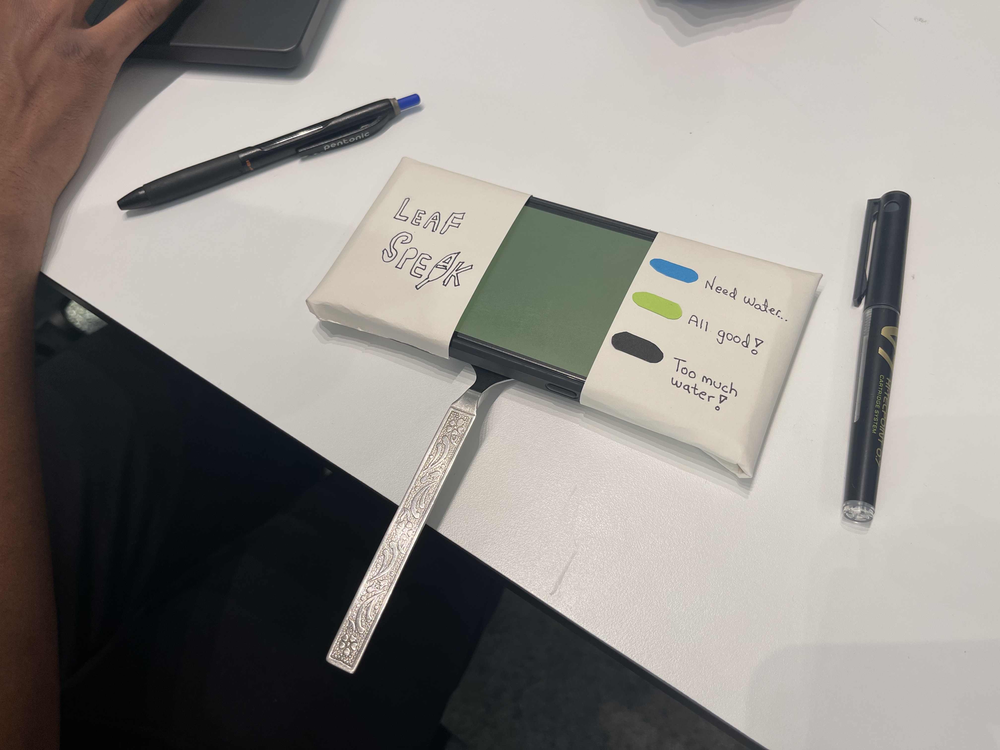
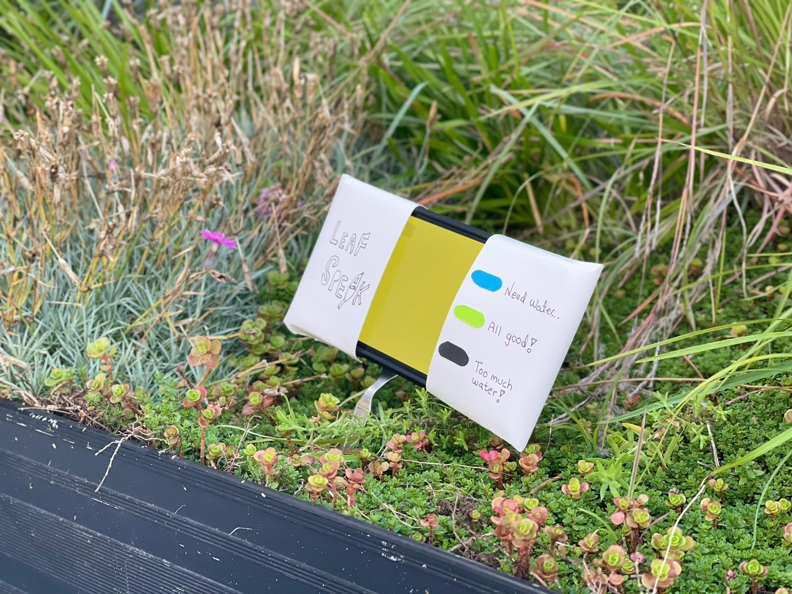
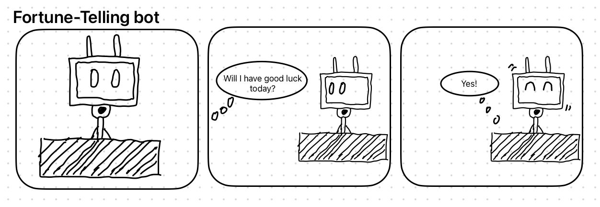
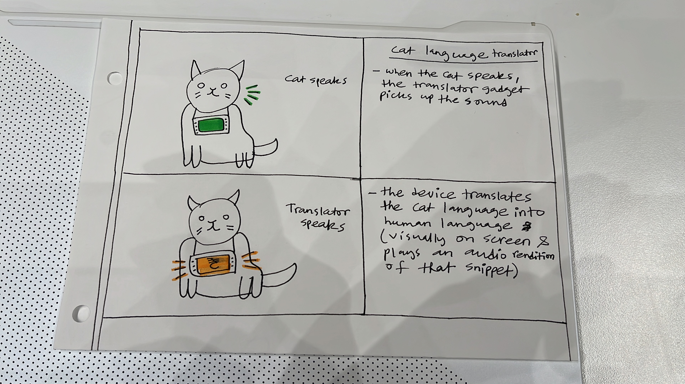
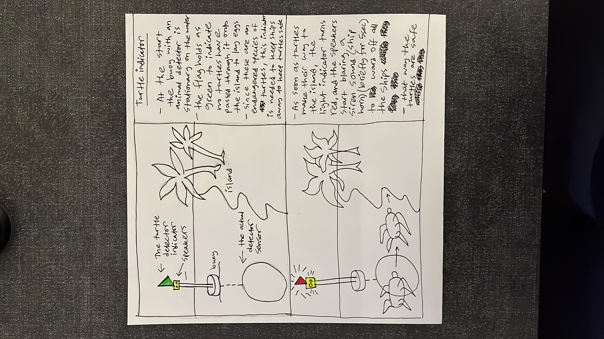

# Staging Interaction (Lab 1a)

** Team Members: Tahmid Kazi, Siddharth Kothari, Omar Mohamed, Yifan Zhou **

In the original stage production of Peter Pan, Tinker Bell was represented by a darting light created by a small handheld mirror off-stage, reflecting a little circle of light from a powerful lamp. Tinkerbell communicates her presence through this light to the other characters. See more info [here](https://en.wikipedia.org/wiki/Tinker_Bell). 

There is no actor that plays Tinkerbell--her existence in the play comes from the interactions that the other characters have with her.

For lab this week, we draw on this and other inspirations from theatre to stage interactions with a device where the main mode of display/output for the interactive device you are designing is lighting. You will plot the interaction with a storyboard, and use your computer and a smartphone to experiment with what the interactions will look and feel like. 

_Make sure you read all the instructions and understand the whole of the laboratory activity before starting!_

## Prep

### To start the semester, you will need:
1. Read about Git [here](https://git-scm.com/book/en/v2/Getting-Started-What-is-Git%3F).
2. Set up your own Github "Lab Hub" repository to keep all you work in record by [following these instructions](https://github.com/FAR-Lab/Developing-and-Designing-Interactive-Devices/blob/2021Fall/readings/Submitting%20Labs.md).
3. Set up the README.md for your Hub repository (for instance, so that it has your name and points to your own Lab 1) and [learn how to](https://guides.github.com/features/mastering-markdown/) organize and post links to your submissions on your README.md so we can find them easily.

### For this lab, you will need:
1. Paper
2. Markers/ Pens
3. Scissors
4. Smart Phone -- The main required feature is that the phone needs to have a browser and display a webpage.
5. Computer -- We will use your computer to host a webpage which also features controls.
6. Found objects and materials -- You will have to costume your phone so that it looks like some other devices. These materials can include doll clothes, a paper lantern, a bottle, human clothes, a pillow case, etc. Be creative!

### Deliverables for this lab are: 
1. 7 Storyboards
1. 3 Sketches/photos of costumed devices
1. Any reflections you have on the process
1. Video sketch of 3 prototyped interactions
1. Submit the items above in the lab1 folder of your class [Github page], either as links or uploaded files. Each group member should post their own copy of the work to their own Lab Hub, even if some of the work is the same from each person in the group.

### The Report
This README.md page in your own repository should be edited to include the work you have done (the deliverables mentioned above). Following the format below, you can delete everything but the headers and the sections between the **stars**. Write the answers to the questions under the starred sentences. Include any material that explains what you did in this lab hub folder, and link it in your README.md for the lab.

## Lab Overview
For this assignment, you are going to:

A) [Plan](#part-a-plan) 

B) [Act out the interaction](#part-b-act-out-the-interaction) 

C) [Prototype the device](#part-c-prototype-the-device)

D) [Wizard the device](#part-d-wizard-the-device) 

E) [Costume the device](#part-e-costume-the-device)

F) [Record the interaction](#part-f-record)

Labs are due on Mondays. Make sure this page is linked to on your main class hub page.

## Part A. Plan 

For our lab submission, we created 3 scenarios to meet the 7 storyboard criterion:

Scenario 1) CrispSense: The food freshness label

Setting: The user opens a refrigerator in a kitchen to see what ingredients they have for cooking their next meal.

Players: The refrigerator and the user

Activity: The user opens the refrigerator and immediately sees visual labels that make it easy to tell apart fresh food from stale food, and those foods about to expire.The label for the items that have expired turn ‘red’ while those about to expire turn orange, and the fresh food is labeled green.

Goals: To visually tell apart food items based on their freshness to allow user to make conscious decisions thereby reducing food wastage.

Scenario 2) LeafSpeak: The plant’s voice

Setting: A plant and a caretaker in a nursery on a bright sunny morning.

Players: The plant and its caretaker

Activity: The LeafSpeak device, positioned in the soil, shifts its color to blue as soon as it identifies the plant's thirst for water. In a plantation or nursery, numerous plants may demand varying amounts of water. These devices individually shift to a 'blue' hue when the particular plant requires hydration, transitioning to green once the water supply suffices, and to black if overwatering occurs. Furthermore, an orange hue emerges when a plant or tree is ripe for harvesting, while a yellow glow signifies the need for increased sunlight.

Goals: To notify the plant’s caretaker about its water/sunlight needs.

Scenario 3) TeamWiz: Your digital assistant to make fair teams

Setting: A table with TeamWiz devices outside a Soccer field with players waiting in a queue to enter the field.

Players: (For the sake of this example, it will be 8 players to correspond with the 8 phones)

Activity: A group of players queue up to pick up their TeamWiz devices. As soon as a TeamWiz device is picked up it turns red or blue indicating which team (red or blue) the user belongs to.
Additionally, should a player or two have to leave the game midway, all TeamWiz devices would blink-change their colors and re-distribute the team for fair play.

Goals: To divide a group of players into teams without any biases.

**Pictures of our storyboards are included below:**

**Summarize feedback you got here.**

Most people liked all ideas, but CrispSense was the most attractive as it is the most useful and applicable to everyone. Plant enthusiasts showed excitement about our idea, but they said it would be better if it could detect this on the plant itself instead of the soil.

## Part B. Act out the Interaction

Try physically acting out the interaction you planned. For now, you can just pretend the device is doing the things you’ve scripted for it. 

\*\***Are there things that seemed better on paper than acted out?**\*\*

For the CrispSense demo, it looked better on paper, since if we put up a screen for every fruit item in the fridge, it might be a bit huge.

\*\***Are there new ideas that occur to you or your collaborators that come up from the acting?**\*\*

It would be a good idea to have TeamWiz be a wearable device (similar to the LED wristbands in concerts) so teams can tell apart their teammates from opposite team.

## Part C. Prototype the device

You will be using your smartphone as a stand-in for the device you are prototyping. You will use the browser of your smart phone to act as a “light” and use a remote control interface to remotely change the light on that device. 

Code for the "Tinkerbelle" tool, and instructions for setting up the server and your phone are [here](https://github.com/FAR-Lab/tinkerbelle).

We invented this tool for this lab! 

If you run into technical issues with this tool, you can also use a light switch, dimmer, etc. that you can can manually or remotely control.

\*\***Give us feedback on Tinkerbelle.**\*\*

Tinkerbelle does what its made for. It would be even better if we had the ability to program a sequence of colors.

## Part D. Wizard the device
Take a little time to set up the wizarding set-up that allows for someone to remotely control the device while someone acts with it. Hint: You can use Zoom to record videos, and you can pin someone’s video feed if that is the scene which you want to record. 

\*\***Include your first attempts at recording the set-up video here.**\*\*

https://youtu.be/ASheoEyk49Y

Now, hange the goal within the same setting, and update the interaction with the paper prototype. 

\*\***Show the follow-up work here.**\*\*

https://youtu.be/ASheoEyk49Y

## Part E. Costume the device

Only now should you start worrying about what the device should look like. Develop three costumes so that you can use your phone as this device.

Think about the setting of the device: is the environment a place where the device could overheat? Is water a danger? Does it need to have bright colors in an emergency setting?

\*\***Include sketches of what your devices might look like here.**\*\*

\*\***What concerns or opportunitities are influencing the way you've designed the device to look?**\*\*

We wanted the device to look 'small' and 'self-contained'. We wouldn't want a garden to have too many visible digital elements shadwing the greenery. While the size of the phone is restricting, the two white covers make the device look capuslar.

## Part F. Record

\*\***Take a video of your prototyped interaction.**\*\*

https://youtu.be/ASheoEyk49Y

\*\***Please indicate anyone you collaborated with on this Lab.**\*\*
Be generous in acknowledging their contributions! And also recognizing any other influences (e.g. from YouTube, Github, Twitter) that informed your design. 

# Staging Interaction, Part 2 (Lab 1b)

This describes the second week's work for this lab activity.

## Prep (to be done before Lab on Wednesday)

You will be assigned three partners from another group. Go to their github pages, view their videos, and provide them with reactions, suggestions & feedback: explain to them what you saw happening in their video. Guess the scene and the goals of the character. Ask them about anything that wasn’t clear. 

\*\***Summarize feedback from your partners here.**\*\*

"Really unique idea with a cool usage of the phone as the "sensor" I think that the costuming could have been a bit better. I think that the usage of light is very clear, but could be a little more creative." - Zack Pakin, Neelraj Patel

"I like the idea of a fridge food indicator. It is useful to know whether the food is expired or not. Also, the plant status indicator is cool, and the video is awesome. A little advice is maybe this device can try to add more than 3 statuses." - Julia Lin

## Make it your own

Do last week’s assignment again, but this time: 
1) It doesn’t have to (just) use light, 
2) You can use any modality (e.g., vibration, sound) to prototype the behaviors! Again, be creative! Feel free to fork and modify the tinkerbell code! 
3) We will be grading with an emphasis on creativity. 

\*\***Document everything here. (Particularly, we would like to see the storyboard and video, although photos of the prototype are also great.)**\*\*

